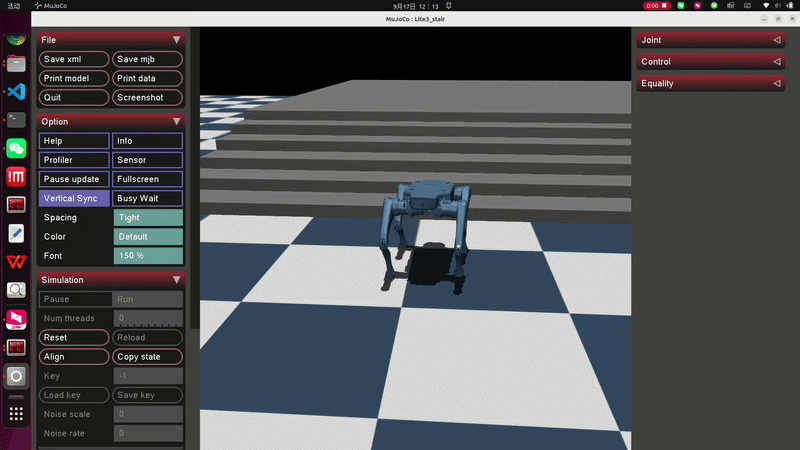

# Lite3 Reinforcement Learning Locomotion

基于 **Isaac Lab + PPO** 的云深处 Lite3 四足机器人强化学习运动控制项目。

本项目在 NVIDIA Isaac Lab 中构建 Lite3 四足机器人训练环境，采用 PPO
(Proximal Policy Optimization) 算法学习运动控制策略，并通过 MuJoCo
进行 Sim2Sim 验证，最终将训练得到的策略部署至 DeepRobotics Lite3
真实机器人。

- 前进
- 后退
- 左右横移
- 转向
- 复杂地形运动
- 上楼梯

  
- Sim2Sim 验证
- Sim2Real 真机部署
