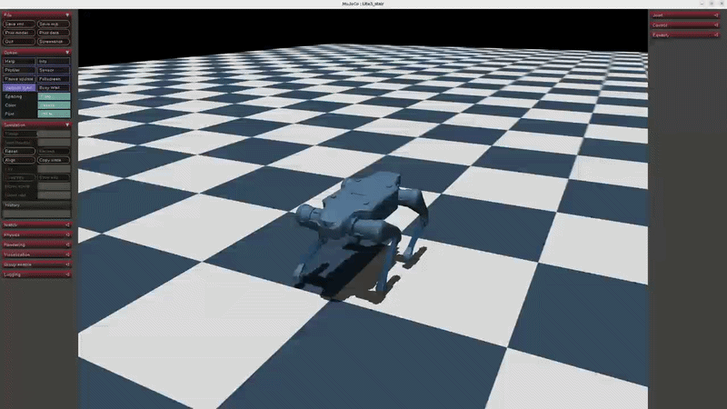
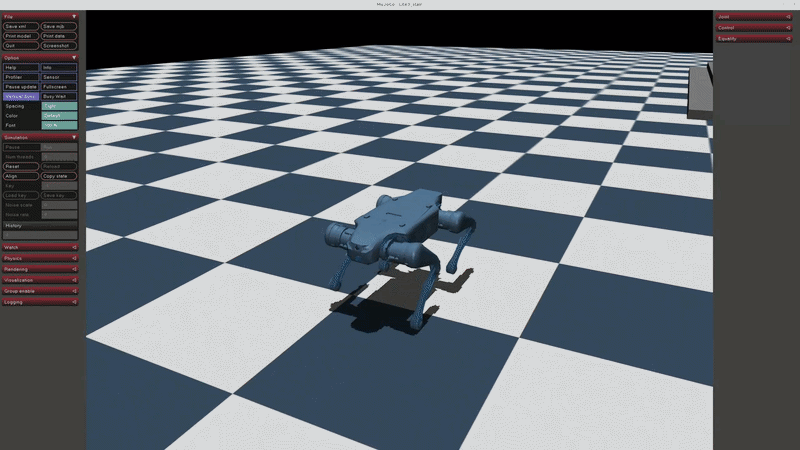
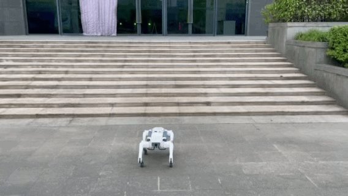

# Lite3 Reinforcement Learning Locomotion

基于 **Isaac Lab + PPO** 的云深处 Lite3 四足机器人强化学习运动控制项目。

本项目在 NVIDIA Isaac Lab 中构建 Lite3 四足机器人训练环境，采用 PPO
(Proximal Policy Optimization) 算法学习运动控制策略，并通过 MuJoCo
进行 Sim2Sim 验证，最终将训练得到的策略部署至 DeepRobotics Lite3
真实机器人。

rl_training:Issac lab平面移动训练代码（前进/后退/转向/横移）
rl_up_training:Issac lab上楼梯训练代码
Lite3_rl_deploy:Issac lab训练后mojoco sim to sim部署代码

- Sim2Sim 验证

- 前进/后退
  

- 左右横移/转向
  

- 上楼梯(3倍速)
  

  
- Sim2Real 真机部署
- 

